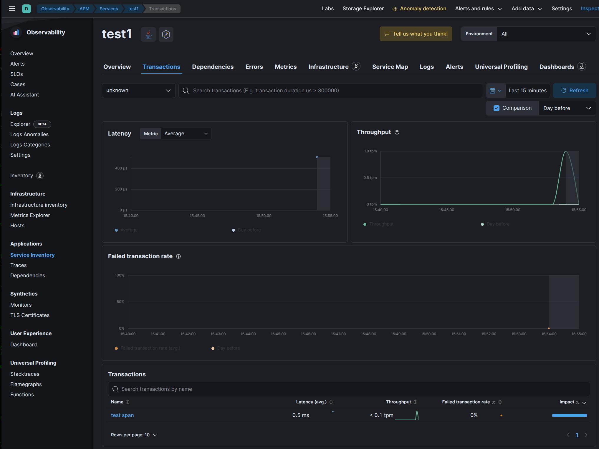
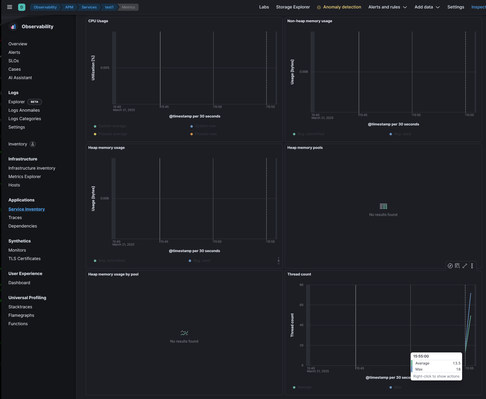
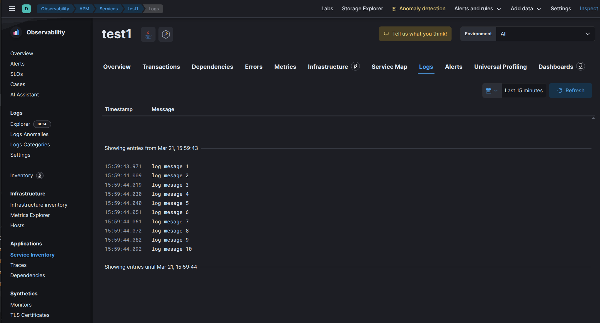

# Troubleshooting EDOT agent setups

This directory holds code examples for testing aspects of running applications
with the EDOT Java agent.

# Building

```shell
./gradlew assemble
```

The application will be packaged in `./build/libs/troubleshooting.jar` with included OpenTelemetry
SDK/API dependencies and an OTLP exporter.

# Running

```shell
java -jar ./build/libs/troubleshooting.jar <signal> <service.name> <endpoint-url> <auth>
```

Where:

- `<signal>`: The signal to send, supported values are `metrics`, `traces` and `logs`.
- `<service-name>`: The name of the service you want to have displayed in the APM UI
- `<endpoint-url>`: The endpoint to send traces to, normally the Elastic APM server or the OpenTelemetry collector, WITHOUT the per-signal suffix like `/v1/traces`.
- `<auth>`: The secret token or API key in the format: `secret:<token>` or `apikey:<apikey>`.

## Traces

With the `traces` signal, a span named `test span` is should be created for the service `<service-name>`.

In the APM UI, you should see something similar to this screenshot:


## Metrics

With the `metrics` signal, a metric `jvm.thread.count` is sent over a few minutes for the service `<service-name>`.

In the APM UI, you should see something similar to this screenshot:


## Logs

With the `logs` signal, a dozen of log messages with a dummy message are sent over a short time for the service `<service-name>`.

In the APM UI, you should see something similar to this screenshot:

